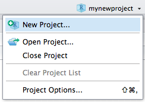
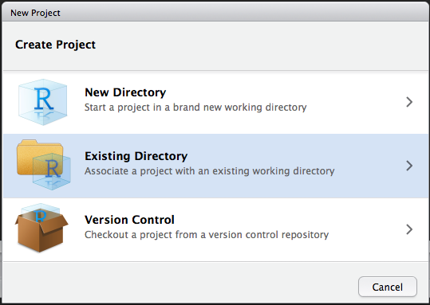

# Project workflows {#workflows}

## Using Workflowr

```{r parent-fig, echo=FALSE, results='hide'}
knitr::current_input()
getwd()
```

```{r parent-chunk-name, echo=FALSE, results='hide'}
library(readr)   ## read_file
child1 <- here::here("WorkflowrWalk/00-quickStart.Rmd")
childy <- read_file(child1)
child2 <- here::here("WorkflowrWalk/00-Installation.Rmd")
childy2 <- read_file(child2)
child3 <- here::here("WorkflowrWalk/01-CreateProject.Rmd")
childy3 <- read_file(child3)
child4 <- here::here("WorkflowrWalk/02-ConnectingGitLab.Rmd")
childy4 <- read_file(child4)
child5 <- here::here("WorkflowrWalk/03-Design.Rmd")
childy5 <- read_file(child5)
child6 <- here::here("WorkflowrWalk/04-style.Rmd")
childy6 <- read_file(child6)
```
	
`r paste(knitr::knit_child(text = childy), collapse = '\n')`
`r paste(knitr::knit_child(text = childy2), collapse = '\n')`
`r paste(knitr::knit_child(text = childy3), collapse = '\n')` 
`r paste(knitr::knit_child(text = childy4), collapse = '\n')`
`r paste(knitr::knit_child(text = childy5), collapse = '\n')`
`r paste(knitr::knit_child(text = childy6), collapse = '\n')`
	
```{r getwd, echo=FALSE, results='hide'}
getwd()
```

## Set Up Workflow and Executing 

### Create a folder for your *newproject*
Come up with a project stucture you like and stick with it.

#### Copy from a previously created template folder

Use `cp -r project_template newproject`, where `project_template` has structure:

```{r img-projectstructure, echo=FALSE}
knitr::include_graphics("images/projectstructure.png")
```

#### Use a `bash` script

Call `./setup_project.sh newproject`, where `setup_project.sh` is:

<pre><code>#!/bin/bash

NEW=$1

## Set up folder structure
mkdir $NEW
cd $NEW

touch README

mkdir data
mkdir data/raw
mkdir data/raw/pheno
mkdir data/interim
mkdir data/processed
mkdir data/processed/pheno
touch data/raw/MAKE_EVERY_FILE_READ_ONLY

mkdir results
mkdir results/reports
mkdir results/notebooks
mkdir results/figures

mkdir sub
mkdir sub/logs
mkdir sub/qsub

mkdir src
touch src/functions.R
</code></pre>

<div class="alert alert-info">
  <strong>Don't forget!</strong> <br>
  - Fill project README <br>
  - Adapt structure to project needs <br>
  - Exclude data and other large files from git using `.gitignore` (see next section)<br>
  - Make files in `data/raw` read-only with `chmod -w`
</div>

<div class="alert alert-warning">
  <strong>Project organization ideas:</strong> <br>
http://projecttemplate.net/getting_started.html <br>
<a href=https://peerj.com/preprints/3192.pdf>Packaging data analytical work reproducibly using R (and friends)</a><br>
<a href=https://community.rstudio.com/clicks/track?url=https%3A%2F%2Fmaraaverick.rbind.io%2F2017%2F09%2Fr-workflow-fun%2F&post_id=8980&topic_id=1995>R workflow fun</a><br>
<a href=https://drivendata.github.io/cookiecutter-data-science/>Cookiecutter Data Science</a><br>
</div>

### Set up a repository for your code on Agios' secure GitLab
Create a new project at <a href>http://ceres.agios.com</a> (Mark P. can help)

### Set up a repository for your code locally and link to GitLab
In your *newproject* folder on command line execute (modify user name):

<pre><code>git init
git add .
git commit -am 'initial commit'
git remote add origin git@ceres.agios.com:User.Name/newproject.git
git push -u origin master 
</code></pre>

### Set up an R project in RStudio
Choose Existing Directory (*newproject*) <br>

```{r img-newproject, echo=FALSE}


```

### Analysis in R and RStudio


**Data:**

  * Raw data:
    + If accessed from the web, include url, description, and date accessed in README
  
  * Processed:
    + Processed data should be named so it is easy to see which script generated the data
      + Can add file descriptions to  `filename.README` and place processing script in the same directory as data (works well for preprocessing steps, like alignments, etc)
    + Processed data should be <a href=http://vita.had.co.nz/papers/tidy-data.pdf>tidy</a>

**Code:**

  * Place (almost) all intermediate scripts in `newproject/src/`
  * Any chunks of code frequently reused in the analysis should be converted into functions, saved in `newproject/src/functions.R`, and sourced in scripts, notebooks and reports.  
  * Use <a href=https://google.github.io/styleguide/Rguide.xml>Google's R Style Guide</a> or <a href=http://style.tidyverse.org>The tidyverse styleguide</a> to format your code and make it easier to read (if need be run code through <a href=https://yihui.name/formatr/>formatR</a>)
  
**Figures:**

  * Exploratory:
    + Don't have to be pretty
    + Can be embedded in report / notebook
  
  * Final:
    + Should be polished and saved in `newproject/results/figures/`
    
**Scripts:**

  * Raw:
    + May be less commented (but comments help you!)
    + May be multiple versions
    + May include analyses that are later discarded
  
  * Final:
    + Clearly commented
    + Small comments liberally - what, when, why, how
    + Bigger commented blocks for whole sections
    + Include processing details
    + Only analyses that appear in the final write-up
    
**Notebooks and reports:**

  * R markdown files can be used to generate reproducible reports

  * Text and R code are integrated

  * Notebooks:
    + intermediate
    + may use one per day or one per subanalysis
    + documents all atempts
    
  * Reports:
    + final methods and results only
    + good for sharing
  

Adapted from: <a href=https://d18ky98rnyall9.cloudfront.net/_675d65293ef671c7dc754b3bd2779da6_Checklist.pdf?Expires=1525392000&Signature=XC-8TNzRrnwFEL5l6xadO9zD1jJxsLjfTwGovr1F6W~lWqZt0B2irE7zHKdQ2kJuQIF650WNaCPJzvnW83E-OaUDaCk4xIhhjdBVwMrJlgDGd3J8sOX2KlL8XRiZTdw3wbXa-C4JZ1r9tpuURHsZyleHTlorJ0ZGWN4VhuBtPd8_&Key-Pair-Id=APKAJLTNE6QMUY6HBC5A>Reproducible Research at Coursera</a> 


### Version control in git and GitLab
Adopt a branching workflow appropriate for the project and team size, and stick to it.

[gitforsmallteams](gitforsmallteams)

<div class="alert alert-info">
Reprinted from: <a href=http://www.joslynesser.com/blog/archives/2010/09/06/git-workflow-for-small-teams/>Git workflow for small teams</a>. Link currently is password protected.
</div>

<div class="alert alert-warning">
**`git` and `git-workflow` resources:**<br>
<a href=https://try.github.io/levels/1/challenges/1>Learn git</a> <br>
<a href=http://nvie.com/posts/a-successful-git-branching-model/>Git branching model</a> <br>
<a href=https://datasift.github.io/gitflow/IntroducingGitFlow.html>GitFlow</a>
</div>

### Keeping track of enviroment
Use `devtools::session_info()` 

<pre><code>> devtools::session_info()
Session info -----------------------------------------------------------------------------------------------------------------
 setting  value                       
 version  R version 3.4.2 (2017-09-28)
 system   x86_64, linux-gnu           
 ui       RStudio (99.9.9)            
 language (EN)                        
 collate  en_US.UTF-8                 
 tz       America/New_York            
 date     2018-05-02                  

Packages ---------------------------------------------------------------------------------------------------------------------
 package   * version date       source        
 backports   1.1.1   2017-09-25 CRAN (R 3.4.2)
 base      * 3.4.2   2017-10-05 local         
 compiler    3.4.2   2017-10-05 local 
 [...]
</code></pre>


or `sessionInfo()`

<pre><code>> sessionInfo()
R version 3.4.2 (2017-09-28)
Platform: x86_64-pc-linux-gnu (64-bit)
Running under: Ubuntu precise (12.04.4 LTS)

Matrix products: default
BLAS: /data2/software/R/3.4.2/lib/R/lib/libRblas.so
LAPACK: /data2/software/R/3.4.2/lib/R/lib/libRlapack.so

locale:
 [1] LC_CTYPE=en_US.UTF-8       LC_NUMERIC=C               LC_TIME=en_US.UTF-8        LC_COLLATE=en_US.UTF-8     LC_MONETARY=en_US.UTF-8    LC_MESSAGES=en_US.UTF-8    LC_PAPER=en_US.UTF-8       LC_NAME=C                 
 [9] LC_ADDRESS=C               LC_TELEPHONE=C             LC_MEASUREMENT=en_US.UTF-8 LC_IDENTIFICATION=C       

attached base packages:
[1] stats     graphics  grDevices utils     datasets  methods   base     

loaded via a namespace (and not attached):
 [1] Rcpp_0.12.13    digest_0.6.12   withr_2.0.0     rprojroot_1.2   backports_1.1.1 magrittr_1.5    evaluate_0.10.1 stringi_1.1.5   rstudioapi_0.7  rmarkdown_1.6   devtools_1.13.3 tools_3.4.2     stringr_1.2.0   yaml_2.1.14     compiler_3.4.2 
[16] memoise_1.1.0   htmltools_0.3.6 knitr_1.17   
</code></pre>

or `docker` with `rrtools`
