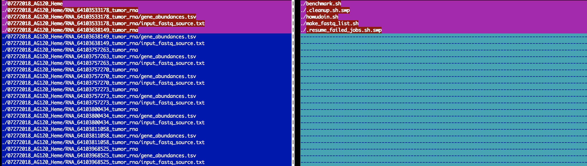

---
output:
  html_document: default
  pdf_document: default
---
# Toolbox {#toolbox}

## Command Line Tools

### Bioinformatics
#### Get average read length from a `.bam` file
```{bash eval=FALSE}
samtools view sorted.bam | head -n 1000000 | cut -f 10 | perl -ne 'chomp;print length($_) . "\n"' | sort | uniq -c
```

### Docker
#### Basic commands
Here are a few helpful commands for working with `docker` images
```{bash eval=FALSE}
docker ps -a               # Lists containers (and tells you which images they are spun from)
docker images              # Lists images  
docker rm <container_id>   # Removes a container

docker rmi <image_id>      # Removes an image 
                           # Will fail if there is a running instance of that image i.e. container

docker rmi -f <image_id>   # Forces removal of image even if it is referenced in multiple repositories, 
                           # i.e. same image id given multiple names/tags 
                           # Will still fail if there is a docker container referencing image
```

#### Pruning
```{bash eval=FALSE}
# remove dangling images 
docker rmi $(docker images --filter “dangling=true” -q --no-trunc)

# find other untagged images (with possible children) (<none>:<none>)
docker images -a | grep "none" | awk '{print $3}'

# try removing them
docker rmi $(docker images -a | grep "none" | awk '{print $3}')

# if any left because of clingy children, get __parent.ID__ (ID of untagged image) and then:
# example: docker inspect --format='{{.Id}} {{.Parent}}' $(docker images --filter since=14a1e7116365 -q)
docker inspect --format='{{.Id}} {{.Parent}}' $(docker images --filter since=__parent.id__ -q)

# then remove listed __children.id__ one by one
# example: docker rmi 382096f13260254f3c472bf63f063b8ecbc2d4cc06fe7a940d6fbd4636ef77b1
docker rmi __child.id__
```

### File system
#### List top 5 largest files
```{bash eval=FALSE}
du -a /path/to/my/dir/ | sort -n -r | head -n 5
```
Example:
```{bash}
du -a /bin | sort -n -r | head -n 5
```

#### List files in a folder separated by delimeter
```{bash eval=FALSE}
ls -1 /path/to/my/dir/ | paste -sd "," -
```
Example:
```{bash}
ls -1 /bin | paste -sd "," -
```

#### Compare structure of two directories
```{bash eval=FALSE}
vimdiff <(cd dir1; find . | sort) <(cd dir2; find . | sort)
```
Example:
```{r vimdiff-image, echo=FALSE}

```

### Sun Grid Engine
#### Deprioritize jobs queued on SGE
```{bash, eval=FALSE}
qalter -p -100 {jobid1..jobidn}
```

### vim
#### Repeat content of line in new column
```{vim}
# repeat content of line
# a
# b
# c
# becomes
# a = C.a
# b = C.b
# c = C.c
:%s/.*/& = C.&
```
## R

### Heatmaps
### Addition
```{r addition}
x <- 3
y <- 4
z <- x+y
z
```

## python

## perl
#### Get number of lines in a file
```{perl eval=FALSE}
open(my $input, "-|", "wc -l < $fastqs");
my $rc = <$input>;
if ($rc =~ /(\d+)/) {
    print $rc;
}
```
